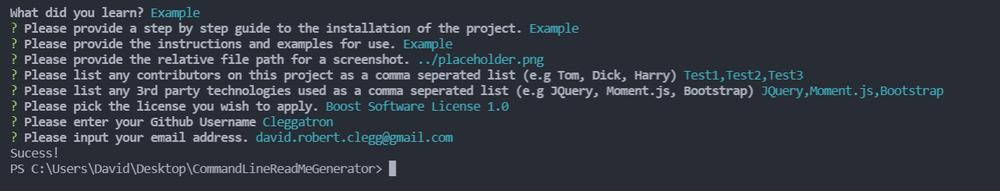

# CommandLineReadMeGenerator

  [Project Repo](https://github.com/Cleggatron/CommandLineReadMeGenerator)
  
  

  ## Description

  This project takes user input from the command line and render a professional Readme.md file that can be used for a repo. This will hopefully save a lot of typing out markdown. It was also a good springboard for me utilising node.js and is my first backend project.

  ## Table Of Contents

  - [Installation](#installation)
  - [Usage](#usage)
  - [Credits](#credits)
  - [License](#license)
  - [Questions](#questions)

  ## Installation

  The project can be installed by clone the project down from the code repo. One must already have Node.js installed on the computer. Then navigate to the directory and run 'npm install' in the terminal to install the dependencies (inquirer, fs, and util).

  ## Usage

  

  Once the dependencies are installed we can open the terminal and run 'node index.js'. The user will then be prompted by series of questions to get hte necessary content for the Readme. The questions should contain all hte information needed to input the data correctly. This will then create the file in a subfolder called GeneratedReadme. Notes: The file path for the screenshot will need to be local to the directories for the end project. 

  ## Credits

  Other Contributors: 
  N/A

  Third Party Technologies:
  The Third Party Code used:
 - Inquirer

  ## License
  The Unlicense

  [License Link](http://unlicense.org/)

  This is free and unencumbered software released into the public domain.

      Anyone is free to copy, modify, publish, use, compile, sell, or
      distribute this software, either in source code form or as a compiled
      binary, for any purpose, commercial or non-commercial, and by any
      means.
      
      In jurisdictions that recognize copyright laws, the author or authors
      of this software dedicate any and all copyright interest in the
      software to the public domain. We make this dedication for the benefit
      of the public at large and to the detriment of our heirs and
      successors. We intend this dedication to be an overt act of
      relinquishment in perpetuity of all present and future rights to this
      software under copyright law.
      
      THE SOFTWARE IS PROVIDED "AS IS", WITHOUT WARRANTY OF ANY KIND,
      EXPRESS OR IMPLIED, INCLUDING BUT NOT LIMITED TO THE WARRANTIES OF
      MERCHANTABILITY, FITNESS FOR A PARTICULAR PURPOSE AND NONINFRINGEMENT.
      IN NO EVENT SHALL THE AUTHORS BE LIABLE FOR ANY CLAIM, DAMAGES OR
      OTHER LIABILITY, WHETHER IN AN ACTION OF CONTRACT, TORT OR OTHERWISE,
      ARISING FROM, OUT OF OR IN CONNECTION WITH THE SOFTWARE OR THE USE OR
      OTHER DEALINGS IN THE SOFTWARE.
      
      For more information, please refer to <http://unlicense.org/>  

  ## Questions

  If you have any questions you can contact me at the below email address:
  david.robert.clegg@gmail.com

  You can also find me at my Github:
  [Github Profile](https://github.com/Cleggatron)

